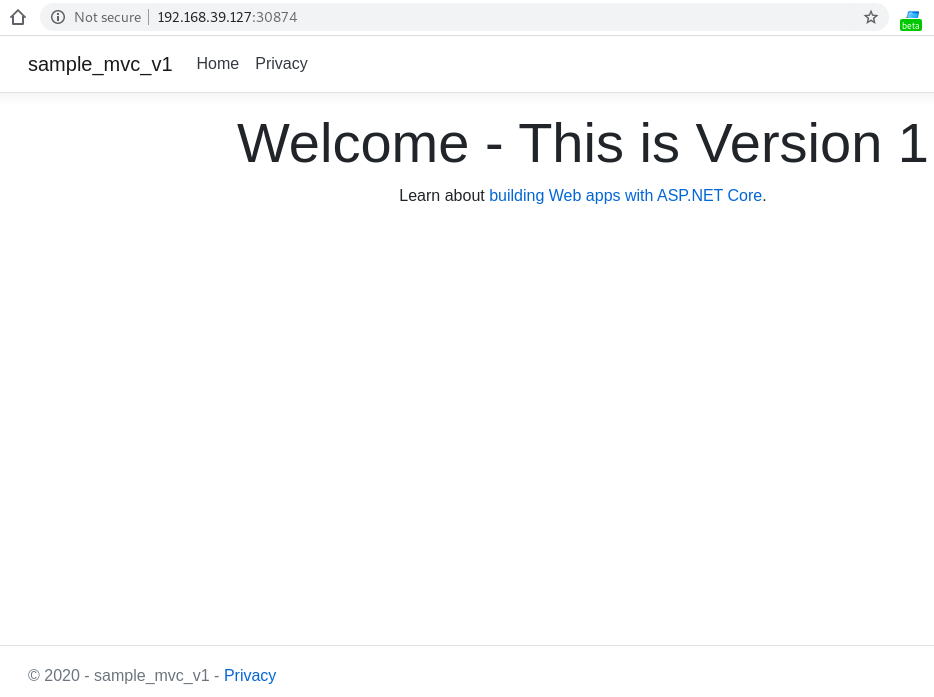
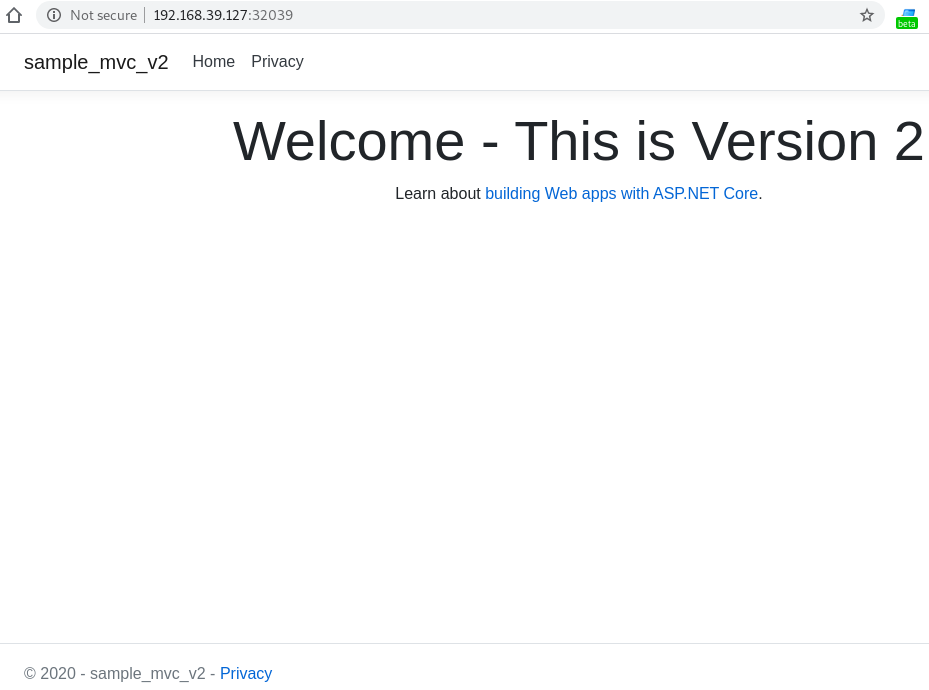
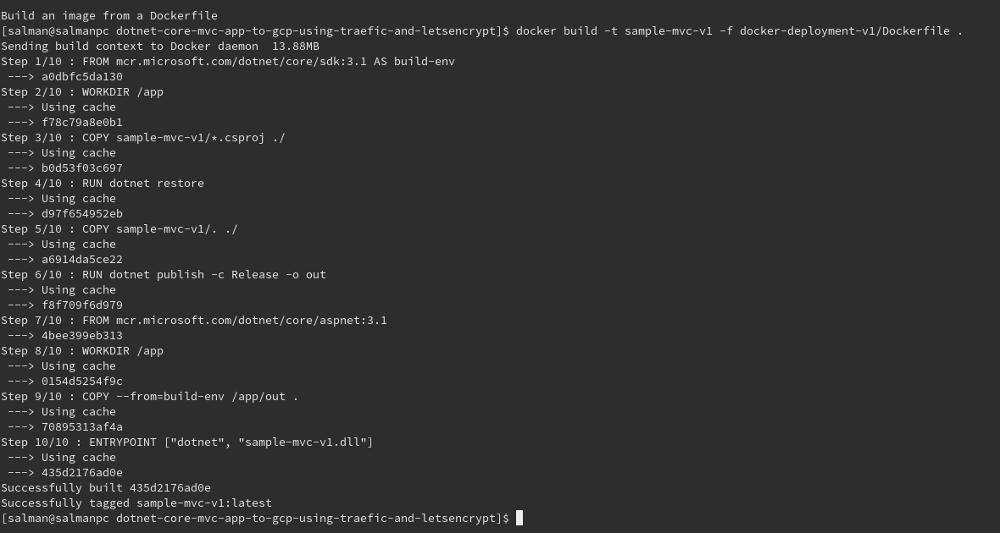
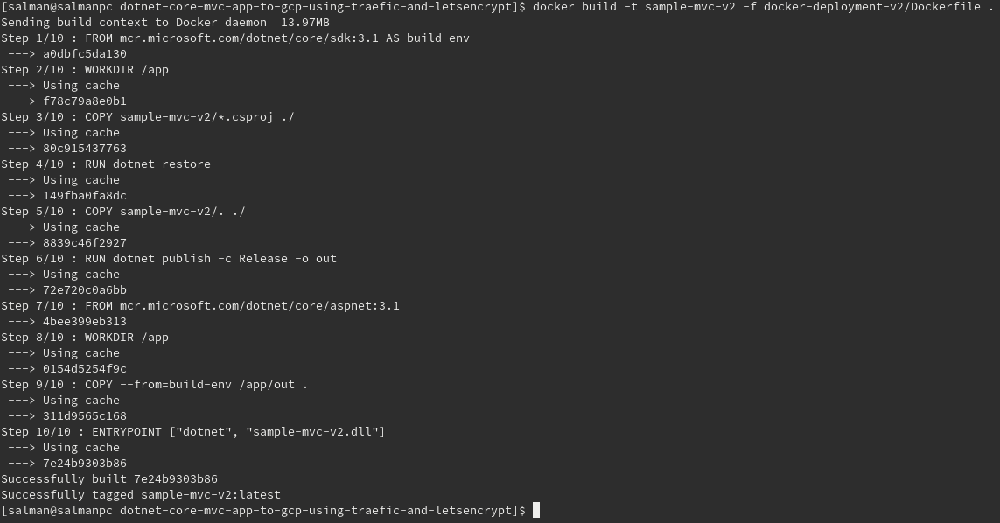
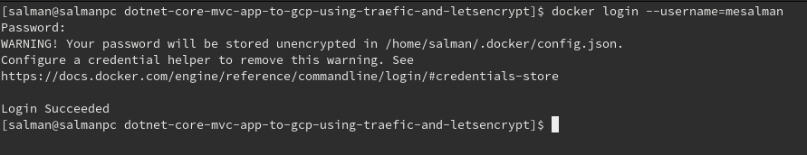
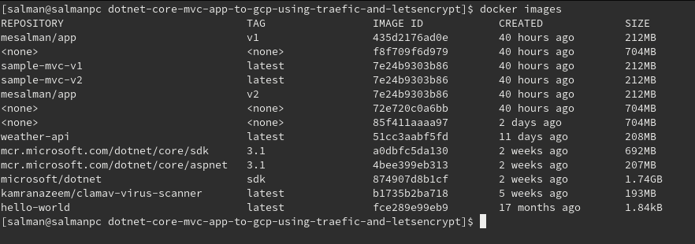
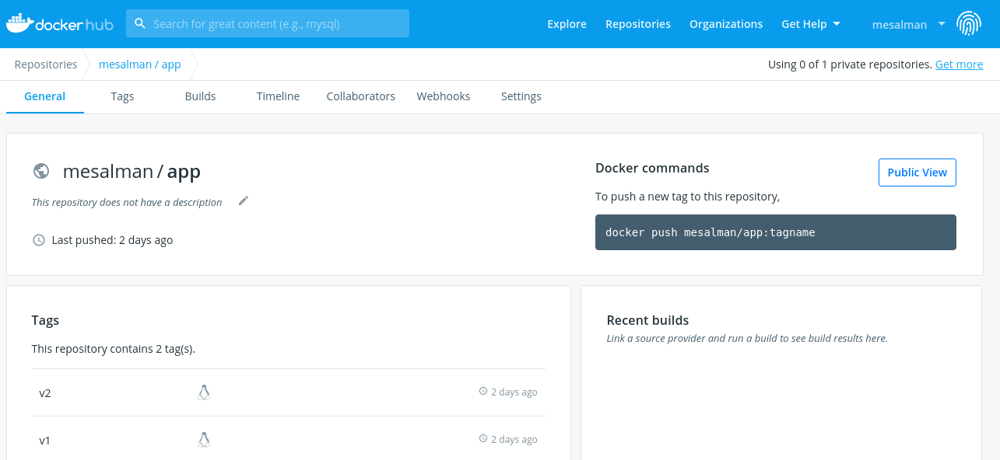

# Setting up .Net Core MVC Web Application

Let's start with a .net core mvc application as an example. We will create 2 mvc applications for this excersize to demonstrate Traefik. To create mvc applications, we can proceed with the terminal command below.

```
dotnet new mvc -o sample-mvc-v1
dotnet new mvc -o sample-mvc-v2
```

This will create a projects with necessory structure. Run the applications by typing following on terminal.

```
dotnet run
```

I have changed the text in both applications to show the difference. Below you can see results from both applications. In the following images you can see both applications are runing with same IP but different ports on Minikube.

**sample-mvc-v1** 


|  |
| ------------------------------------------------------------------- |


**sample-mvc-v2**


|  |
| ------------------------------------------------------------------- |

# Docker Preparations

To dockerize the MVC applications, we need the Dockerfile file, as you are familiar with, that we can encode it as follows.

**Dockerfile for sample-mvc-v1**

```
FROM mcr.microsoft.com/dotnet/core/sdk:3.1 AS build-env
WORKDIR /app

# Copy csproj and restore as distinct layers
COPY sample-mvc-v1/*.csproj ./
RUN dotnet restore

# Copy everything else and build
COPY sample-mvc-v1/. ./
RUN dotnet publish -c Release -o out

# Build runtime image
FROM mcr.microsoft.com/dotnet/core/aspnet:3.1
WORKDIR /app
COPY --from=build-env /app/out .
ENTRYPOINT ["dotnet", "sample-mvc-v1.dll"]
```

**Dockerfile for sample-mvc-v2**

```
FROM mcr.microsoft.com/dotnet/core/sdk:3.1 AS build-env
WORKDIR /app

# Copy csproj and restore as distinct layers
COPY sample-mvc-v2/*.csproj ./
RUN dotnet restore

# Copy everything else and build
COPY sample-mvc-v2/. ./
RUN dotnet publish -c Release -o out

# Build runtime image
FROM mcr.microsoft.com/dotnet/core/aspnet:3.1
WORKDIR /app
COPY --from=build-env /app/out .
ENTRYPOINT ["dotnet", "sample-mvc-v2.dll"]
```

After completing the dockerfile file, we can start dockerizing both applications and build the images. Use the build command as follows.

```
docker build -t mesalman/app:v1 -f docker-deployment-v1/Dockerfile .
docker build -t mesalman/app:v2 -f docker-deployment-v2/Dockerfile .
```

This will create 2 docker images tagged with "mesalman/app:v1" and "mesalman/app:v2" respectively. See below.


**Docker image for mesalman/app:v1**

|  |
| ------------------------------------------------------------------- |


**Docker image for mesalman/app:v2**

|  |
| ------------------------------------------------------------------- |

Now its time to push the docker images to dockerhub as public images so that we can pull them on Google Cloud while deploying our applications. First we login to dockerhub if not already. Use following command on terminal.

```
docker login --username=mesalman
```

It will ask your password. Write password and hit enter. You will see something like below.

|  |
| ------------------------------------------------------------------- |


Check the images using  

```
docker images
```

and what you will see will be similar to

|  |
| ------------------------------------------------------------------- |


To push the images to dockerhub use following commands on terminal

```
docker push mesalman/app:v1
docker push mesalman/app:v2
```

Now you can see images are uploaded to dockerhub.


|  |
| -------------------------------------


**(To do)**

Now, we move forward to create and prepare our first cluster in Google Cloud to move our applications. 
The steps to do that are here: 
Preparing Google Cloud [Part 2](PART-2.md)

