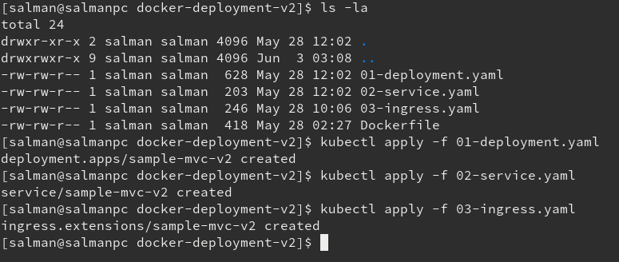

# Deploying .Net Core MVC Web Application to Google Cloud

First of all we need to set up our reverse proxy (Ingress controller) that will handle the in-comming trafic from outside and redirect it to mapped service. To impliment/deploy traefik please follow the **[instructions](traefik/README.md).**

|  |
| ------------------------------------------------------------------- |

* Step 01 - List Traefik Directory Files

|  |
| ------------------------------------------------------------------- |

* Step 02 - Create Configmap

|  |
| ------------------------------------------------------------------- |

* Step 03 - Create Password File

|  |
| ------------------------------------------------------------------- |

* Step 04 - Create Secret

|  |
| ------------------------------------------------------------------- |

* Step 05 - Create Traefik RBAC

|  |
| ------------------------------------------------------------------- |

* Step 06 - Create Traefik Deployment

|  |
| ------------------------------------------------------------------- |

* Step 07 - Create Traefik Service

|  |
| ------------------------------------------------------------------- |

* Step 08 - Check & Wait For External IP

|  |
| ------------------------------------------------------------------- |

* Step 09 - Check & Fix DNS Settings With New IP

|  |
| ------------------------------------------------------------------- |

|  |
| ------------------------------------------------------------------- |

* Step 10 - Create Traefik Ingress 

|  |
| ------------------------------------------------------------------- |


Our applications will be access through following url's

* appv1.digitalbarries.com
* appv2.digitalbarries.com


Now we create 2 deployments for our applications to run in pods on GCP. The deployment files will look as follows.

**Deployment file for mvc application v1**

```
apiVersion: apps/v1
kind: Deployment
metadata:
  name: sample-mvc-v1
  labels:
    app: sample-mvc
    version: v1
spec:
  selector:
    matchLabels:
      app: sample-mvc
      version: v1
  replicas: 1
  template:
    metadata:
      labels:
        app: sample-mvc
        version: v1
    spec:
      containers:
        - name: sample-mvc
          #imagePullPolicy: Never
          image: mesalman/app:v1
          resources:
            limits:
              memory: "50Mi"
              cpu: "50m"
            requests:
              memory: "20Mi"
              cpu: "20m"
          ports:
          - containerPort: 80
```

**Deployment file for mvc application v2**

```
apiVersion: apps/v1
kind: Deployment
metadata:
  name: sample-mvc-v2
  labels:
    app: sample-mvc
    version: v2
spec:
  selector:
    matchLabels:
      app: sample-mvc
      version: v2
  replicas: 1
  template:
    metadata:
      labels:
        app: sample-mvc
        version: v2
    spec:
      containers:
        - name: sample-mvc
          #imagePullPolicy: Never
          image: mesalman/app:v2
          resources:
            limits:
              memory: "50Mi"
              cpu: "50m"
            requests:
              memory: "20Mi"
              cpu: "20m"
          ports:
          - containerPort: 80
```

Now we need our services that will be exposed on top of our deployment and let us talk to our applications running in pods.


**Service for mvc application v1**

```
apiVersion: v1
kind: Service
metadata:
  name: sample-mvc-v1
  labels:
    app: sample-mvc
    version: v1
spec:
  ports:
    - port: 80
  selector:
    app: sample-mvc
    version: v1
  type: ClusterIP
```
         
**Service for mvc application v2**

```
apiVersion: v1
kind: Service
metadata:
  name: sample-mvc-v2
  labels:
    app: sample-mvc
    version: v2
spec:
  ports:
    - port: 80
  selector:
    app: sample-mvc
    version: v2
  type: ClusterIP
```
         
Last but not least we needs to great ingress.


**Ingress for mvc application v1**

```
apiVersion: extensions/v1beta1
kind: Ingress
metadata:
  name: sample-mvc-v1
spec:
  rules:
  - host: appv1.digitalbarries.com
    http:
      paths:
      - path: /
        backend:
          serviceName: sample-mvc-v1
          servicePort: 80
```

**Ingress for mvc application v2**

```
apiVersion: extensions/v1beta1
kind: Ingress
metadata:
  name: sample-mvc-v2
spec:
  rules:
  - host: appv2.digitalbarries.com
    http:
      paths:
      - path: /
        backend:
          serviceName: sample-mvc-v2
          servicePort: 80
```

We are now ready to deploy our applications to GCP. Change directory to "docker-deployment-v1" and run following commands on terminal


```
kubectl apply -f 01-deployment.yaml
kubectl apply -f 02-service.yaml
kubectl apply -f 03-ingress.yaml
```

|  |
| ------------------------------------------------------------------- |


Change directory to "docker-deployment-v2" and repeat the same step for application v2. 

```
kubectl apply -f 01-deployment.yaml
kubectl apply -f 02-service.yaml
kubectl apply -f 03-ingress.yaml
```

|  |
| ------------------------------------------------------------------- |


Once done you go to google cloud console/dashboard and you will see your pods, services and ingress ready as below.

|  |
| ------------------------------------------------------------------- |


|  |
| ------------------------------------------------------------------- |

Last but not the least we now check our applications by using following url's

* appv1.digitalbarries.com
* appv2.digitalbarries.com

The result is as follows.

|  |
| ------------------------------------------------------------------- |

|  |
| ------------------------------------------------------------------- |
