# .Net core app to GCP using Traefic and LetsEncypt

This repository aims to deploye .Net core mvc application to Google Cloud with Traefic as ingress controller and LetsEncrypt. We will run 2 mvc applications in 2 different pods (sample-mvc-v1 & sample-mvc-v2) and redirect the request by using Traefic. We will also use SSL certificate by using HTTP challange in LetsEncrypt.

# Prerequisite

* Google Cloud Account
* Dockerhub Account
* Visual Studio Code
* Docker Engine [Install Docker](https://github.com/salman-mukhtar/setting-up-kubernetes-environment/blob/master/README.md)
* Google Cloud SDK & Kubectl [Install gcloud SDK & kubectl](https://github.com/salman-mukhtar/setting-up-kubernetes-environment/blob/master/README.md)

# Setting up .Net Core Web API

Let's start with a .net core mvc application as an example. We will create 2 mvc applications for this excersize to demonstrate Traefik. To create mvc applications, we can proceed with the terminal command below.

```
dotnet new mvc -o sample-mvc-v1
dotnet new mvc -o sample-mvc-v2
```

This will create a projects with necessory structure. Run the applications by typing following on terminal.

```
dotnet run
```

I have changed the text in both applications to show the difference. Below you can see results from both applications. In the following images you can see both applications are runing with same IP but different ports on Minikube.

**sample-mvc-v1** 


| 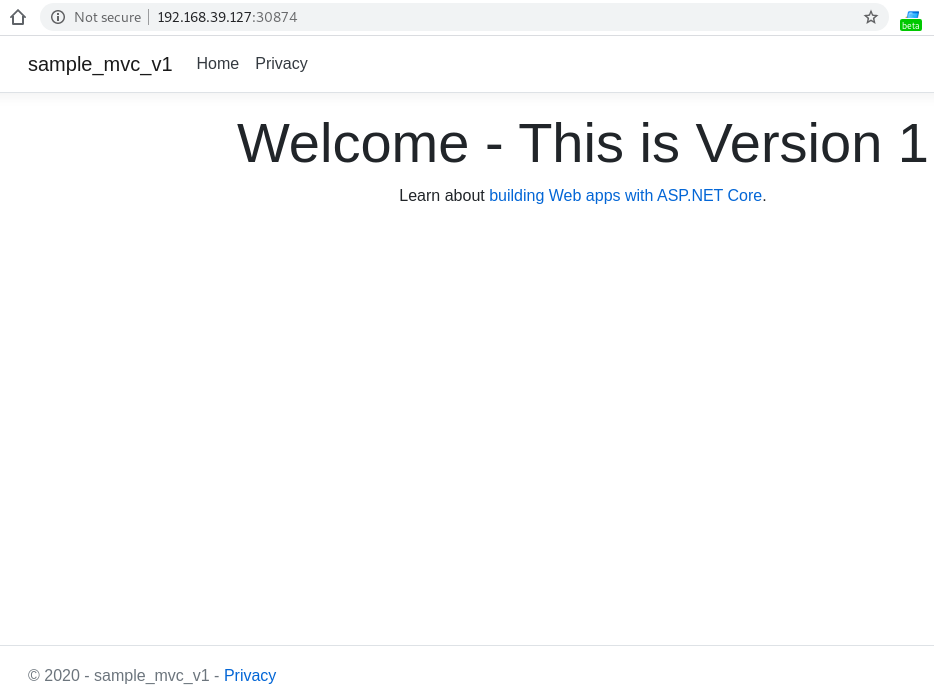 |
| ------------------------------------------------------------------- |


**sample-mvc-v2**


|  |
| ------------------------------------------------------------------- |

# Docker Preparations

To dockerize the MVC applications, we need the Dockerfile file, as you are familiar with, that we can encode it as follows.

**Dockerfile for sample-mvc-v1**

```
FROM mcr.microsoft.com/dotnet/core/sdk:3.1 AS build-env
WORKDIR /app

# Copy csproj and restore as distinct layers
COPY sample-mvc-v1/*.csproj ./
RUN dotnet restore

# Copy everything else and build
COPY sample-mvc-v1/. ./
RUN dotnet publish -c Release -o out

# Build runtime image
FROM mcr.microsoft.com/dotnet/core/aspnet:3.1
WORKDIR /app
COPY --from=build-env /app/out .
ENTRYPOINT ["dotnet", "sample-mvc-v1.dll"]
```

**Dockerfile for sample-mvc-v2**

```
FROM mcr.microsoft.com/dotnet/core/sdk:3.1 AS build-env
WORKDIR /app

# Copy csproj and restore as distinct layers
COPY sample-mvc-v2/*.csproj ./
RUN dotnet restore

# Copy everything else and build
COPY sample-mvc-v2/. ./
RUN dotnet publish -c Release -o out

# Build runtime image
FROM mcr.microsoft.com/dotnet/core/aspnet:3.1
WORKDIR /app
COPY --from=build-env /app/out .
ENTRYPOINT ["dotnet", "sample-mvc-v2.dll"]
```

After completing the dockerfile file, we can start dockerizing both applications and build the images. Use the build command as follows.

```
docker build -t mesalman/app:v1 -f docker-deployment-v1/Dockerfile .
docker build -t mesalman/app:v2 -f docker-deployment-v2/Dockerfile .
```

This will create 2 docker images tagged with "mesalman/app:v1" and "mesalman/app:v2" respectively. See below.


**Docker image for mesalman/app:v1**

| 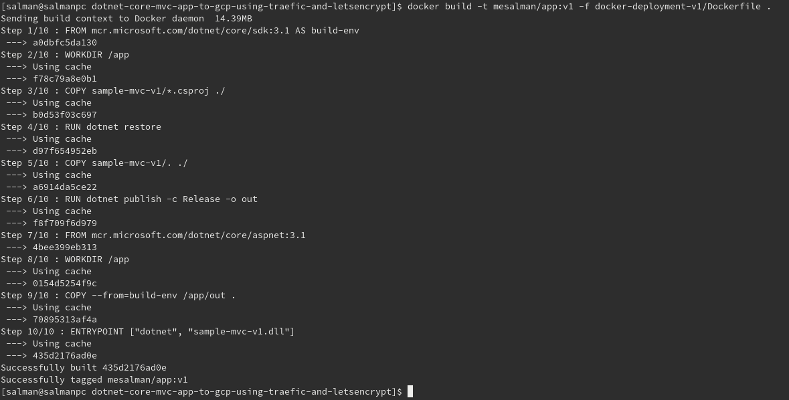 |
| ------------------------------------------------------------------- |


**Docker image for mesalman/app:v2**

| 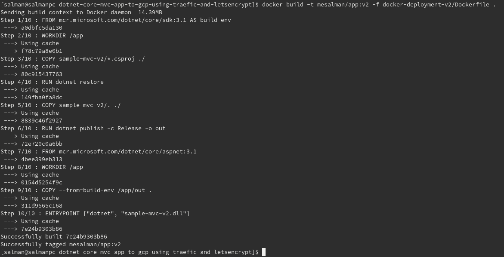 |
| ------------------------------------------------------------------- |

Now its time to push the docker images to dockerhub as public images so that we can pull them on Google Cloud while deploying our applications. First we login to dockerhub if not already. Use following command on terminal.

```
docker login --username=mesalman
```

It will ask your password. Write password and hit enter. You will see something like below.

| 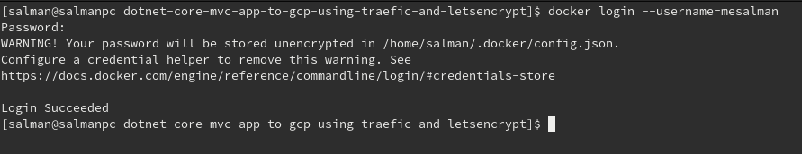 |
| ------------------------------------------------------------------- |


Check the images ID using  

```
docker images
```

and what you will see will be similar to

|  |
| ------------------------------------------------------------------- |


To push the images to dockerhub use following commands on terminal

```
docker push mesalman/app:v1
docker push mesalman/app:v2
```

Now you can see images are uploaded to dockerhub.


| 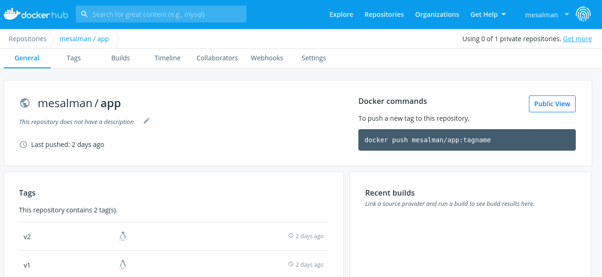 |
| -------------------------------------


# Deploying MVC Web Application to Google Cloud

Now we are ready to deploy our applications to GCP. To proceed we need to have following setup

* **[Create a Google Account](https://console.cloud.google.com)**
* **Create a Project**
  * Go to the Manage resources page in the Cloud Console
  * On the Select organization drop-down list at the top of the page, select the organization in which you 
  want to create a project. If you are a free trial user, skip this step, as this list does not appear.
  * Click Create Project.
  * In the New Project window that appears, enter a project name and select a billing account as applicable. A project name can contain only letters, numbers, single quotes, hyphens, spaces, or exclamation points, and must be between 4 and 30 characters.
  * If you want to add the project to a folder, enter the folder name in the Location box.
  * When you're finished entering new project details, click Create. 


| 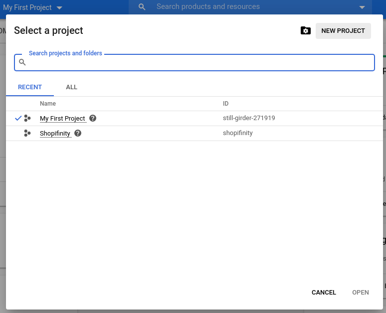 |
| -------------------------------------


| 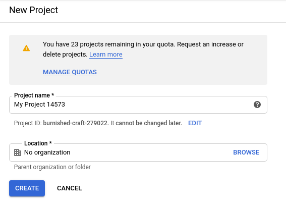 |
| -------------------------------------

* **Create a Cluster**
    * Visit the Google Kubernetes Engine menu in Cloud Console.
    * Click the Create cluster button.
    * In the Cluster basics section, complete the following:
      * Enter the Name for your cluster.
      * For the Location type, select Zonal, and then select the desired zone for your cluster.
    * From the navigation pane, under Node Pools, click default-pool.
    * In the Node pool details section, complete the following:
      * Enter a Name for the default Node pool.
      * Choose the Node version for your nodes.
      * Enter the Number of nodes to create in the cluster. You must have available resource quota for the nodes and their resources (such as firewall routes).
	* From the navigation pane, under Node Pools, click Nodes.
	* From the Image type drop-down list, select the desired node image.
	* Choose the default Machine configuration to use for the instances. Each machine type is billed differently. The default machine type is n1-standard-1. 
	* From the Boot disk type drop-down list, select the desired disk type.
	* Enter the Boot disk size.
	* Click Create.
	
|  |
| -------------------------------------
	
| 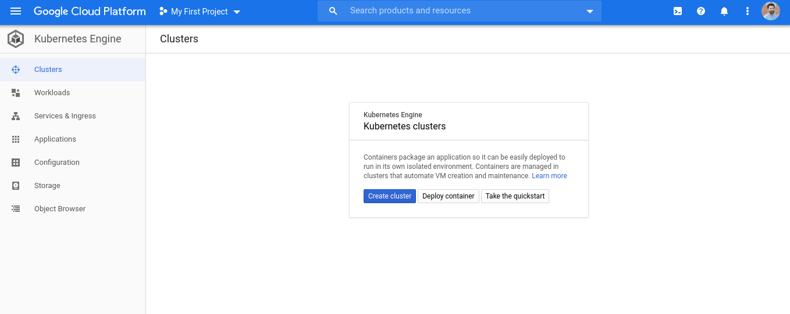 |
| -------------------------------------
	
|  |
| -------------------------------------
	
|  |
| -------------------------------------
	
| 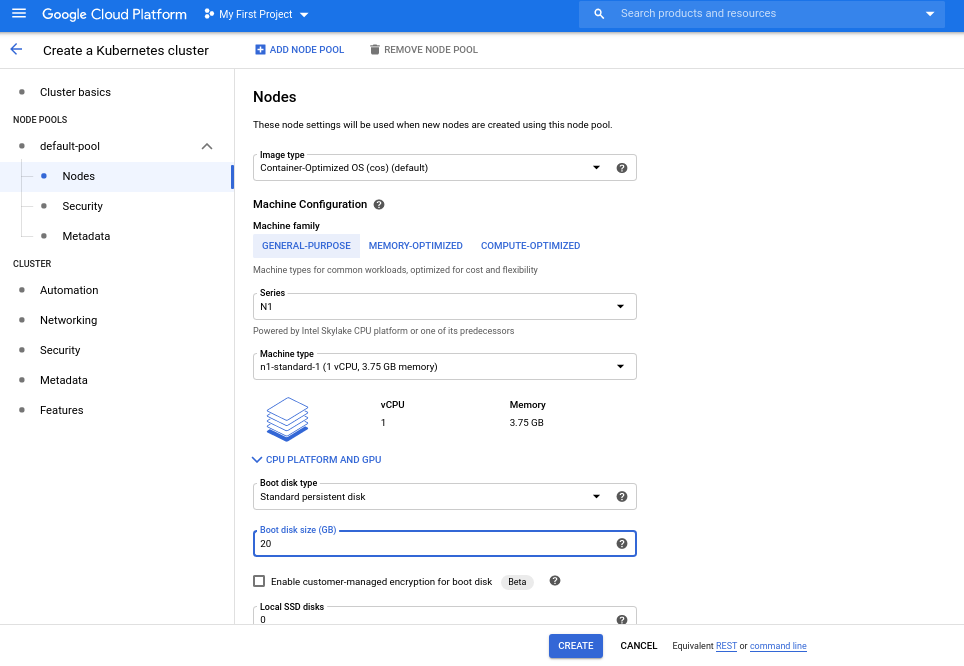 |
| -------------------------------------
	
| 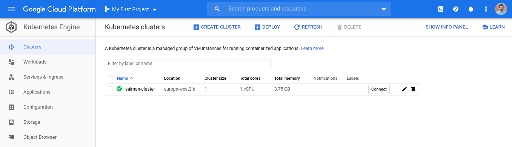 |
| -------------------------------------
	

Now we are ready to connect to our newly created cluster. To do so please follow these steps.


* **Logging/Connect in to a Cluster**

Now we need to give **"kubectl"** access so that we can run commands.
To log in to a cluster, perform the following steps:

* Visit the GKE menu in Cloud Console.
* From the list of clusters, click the Connect button beside the registered cluster.

Choose how you'd like to log in:

* If you are using a KSA token to log in, select Token, fill the Token field with the KSA's bearer token, and then click Login.
* If you are using basic authentication, select Basic authentication, fill the Username and Password fields, and then click Login.
* If you are using OpenID Connect (OIDC), select OpenID Connect, then click Login.
* If you authenticate successfully, you are able to inspect the cluster and get details about its nodes.

|  |
| -------------------------------------
	
|  |
| -------------------------------------
	

Check the context to be sure you are connected with the Cluster. To do so run following command on terminal.

```
kubectl config get-contexts
```

The name of the context is made of Project ID-Zone-Cluster Name You will see something like follwoing.

| 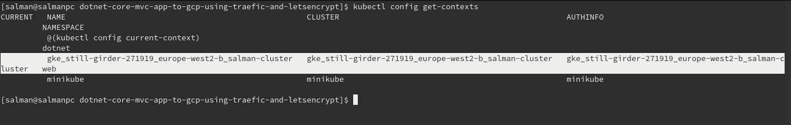 |
| -------------------------------------
